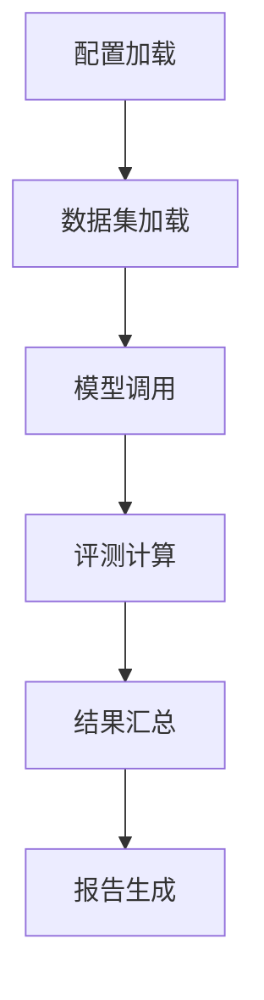
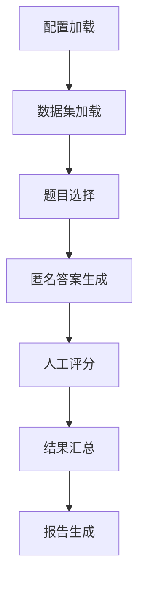
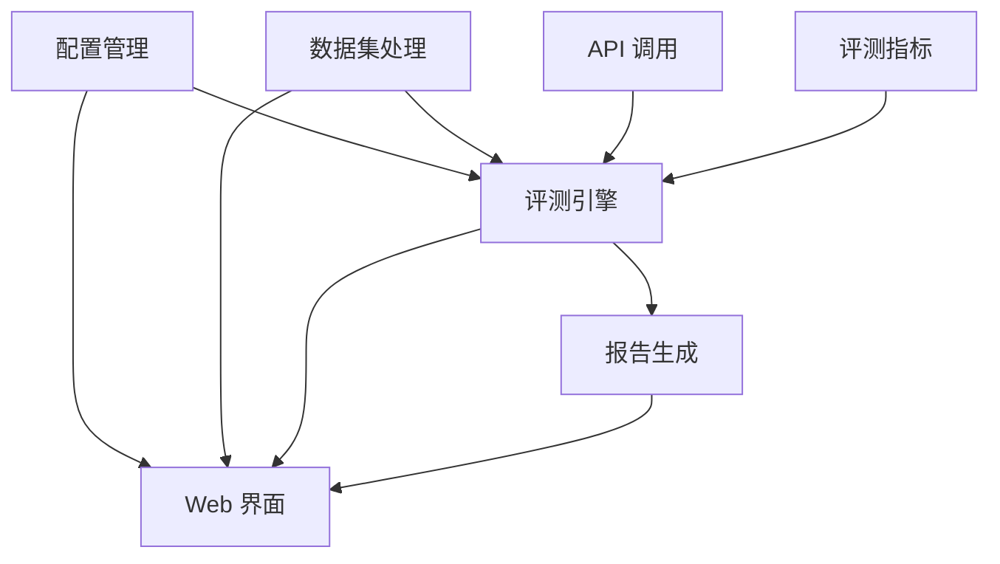

 ---
layout: default
title: 架构设计
parent: 开发者指南
nav_order: 1
---

# 架构设计
{: .no_toc }

<details open markdown="block">
  <summary>
    目录
  </summary>
  {: .text-delta }
1. TOC
{:toc}
</details>

本文档详细介绍 XpertEval 框架的架构设计，包括目录结构、核心模块和工作流程。

## 整体架构

XpertEval 采用模块化设计，主要包括以下核心组件：

1. **配置管理**：负责加载和验证模型 API 配置
2. **数据集处理**：负责加载、解析和管理评测数据集
3. **API 调用**：负责与模型 API 进行通信
4. **评测引擎**：负责协调评测流程，包括自动化评测和人工评测
5. **评测指标**：负责计算各种评测指标
6. **报告生成**：负责生成评测报告
7. **Web 界面**：提供用户友好的操作界面

## 目录结构

```
.XpertEval/
├── .github/                    # GitHub 相关配置
│   └── workflows/
│       └── docs_deploy.yml     # GitHub Pages 部署工作流
├── xperteval/                  # 项目核心代码包
│   ├── config/                 # 模型 API 配置模块
│   ├── core/                   # 评测核心逻辑
│   ├── datasets/               # 数据集处理与加载
│   ├── evaluators/             # 评测指标实现
│   ├── models/                 # 模型接口封装
│   ├── reporters/              # 报告生成模块
│   ├── webui/                  # Gradio Web 界面
│   └── utils/                  # 通用工具函数
├── data/                       # 评测数据集
│   ├── custom/                 # 用户自定义数据集
│   ├── downloads/              # 数据集下载临时目录
│   ├── examples/               # 示例数据集
│   └── integrated/             # 集成的开源数据集
├── docs/                       # 项目文档
├── tests/                      # 测试代码
│   ├── unit/                   # 单元测试
│   └── integration/            # 集成测试
├── scripts/                    # 辅助脚本
├── results/                    # 评测结果输出目录
├── templates/                  # 模板文件
├── app.py                      # WebUI 启动入口
├── main.py                     # 命令行评测程序入口
├── Dockerfile                  # Docker 配置文件
├── requirements.txt            # Python 依赖包列表
└── VERSION                     # 项目版本号文件
```

## 核心模块详解

### 配置管理 (`xperteval/config/`)

- **`config_loader.py`**: 负责加载和验证模型配置文件（YAML 或 JSON 格式）
  - `load_model_configs(config_path)`: 加载配置文件
  - 验证配置有效性（至少两个模型，正确设置 MAIN_API 等）

### 数据集处理 (`xperteval/datasets/`)

- **`base_dataset.py`**: 定义数据集基类接口
- **`xpert_format.py`**: 实现 XpertFormat 格式数据集的解析
- **`registered_datasets.py`**: 管理已注册的数据集
- **`dataset_manager.py`**: 提供数据集下载、转换和管理功能
- **`common_benchmarks/`**: 通用评测数据集解析器
- **`multimodal_benchmarks/`**: 多模态评测数据集解析器
- **`converters/`**: 数据集格式转换工具

### API 调用 (`xperteval/core/api_caller.py`)

- 封装对 OpenAI 兼容 API 的调用逻辑
- 处理请求发送、响应解析、错误处理、超时控制等
- 支持不同模态（文本、图像、音频）的 API 请求格式

### 评测引擎 (`xperteval/core/`)

- **`auto_eval_engine.py`**: 自动化评测引擎
  - 协调数据集加载、模型调用、评测指标计算、结果汇总
- **`manual_eval_engine.py`**: 人工评测引擎
  - 管理人工评测流程，包括匿名答案生成、评分收集等
- **`base_evaluator.py`**: 评测器基类，定义评测指标接口

### 评测指标 (`xperteval/evaluators/`)

- **`common/`**: 通用能力评测指标
  - `accuracy.py`: 准确率评测
  - `bleu.py`: BLEU 分数评测
  - 其他通用评测指标
- **`tcm/`**: 中医药领域特定评测指标
  - `diagnosis_eval.py`: 中医诊断准确性评测
  - 其他中医药特定评测指标

### 报告生成 (`xperteval/reporters/`)

- **`report_generator.py`**: 生成评测报告
  - 支持多种格式（Markdown、JSON、HTML）
  - 包含对比图表、评分汇总、主 API 为中心的总结

### Web 界面 (`xperteval/webui/`)

- **`app_gradio.py`**: Gradio Web 应用
  - 模型配置界面
  - 自动化评测界面
  - 人工评测界面
  - 结果查看界面

## 工作流程

### 自动化评测流程

1. **配置加载**：加载并验证模型 API 配置
2. **数据集加载**：加载评测数据集
3. **模型调用**：对每个样本，调用所有已配置模型的 API 获取预测结果
4. **评测计算**：使用各种评测指标计算分数
5. **结果汇总**：汇总所有样本的评测结果
6. **报告生成**：生成评测报告



### 人工评测流程

1. **配置加载**：加载并验证模型 API 配置
2. **数据集加载**：加载评测数据集
3. **题目选择**：从数据集中选择题目
4. **匿名答案生成**：调用所有模型 API，获取匿名答案
5. **人工评分**：收集人工评分
6. **结果汇总**：汇总所有题目的评分结果
7. **报告生成**：生成人工评测报告



## 扩展点

XpertEval 框架设计了多个扩展点，方便开发者进行功能扩展：

1. **新数据集支持**：
   - 继承 `BaseDataset` 类实现新的数据集解析器
   - 在 `registered_datasets.py` 中注册新数据集类型

2. **新评测指标**：
   - 继承 `BaseEvaluator` 类实现新的评测指标
   - 在相应目录（`common/` 或 `tcm/`）中添加实现文件

3. **新模型类型支持**：
   - 在 `api_caller.py` 中添加新模型类型的请求处理逻辑
   - 更新配置验证逻辑以支持新的模型类型

4. **新报告格式**：
   - 在 `report_generator.py` 中添加新的报告格式生成方法
   - 创建相应的报告模板（如适用）

## 依赖关系

主要模块之间的依赖关系如下：

- **评测引擎**：依赖于配置管理、数据集处理、API 调用和评测指标
- **报告生成**：依赖于评测引擎的输出结果
- **Web 界面**：依赖于配置管理、数据集处理、评测引擎和报告生成



## 技术选型

- **配置文件格式**：YAML 或 JSON，兼顾可读性和易解析性
- **Web 界面框架**：Gradio，快速搭建交互式界面
- **文档风格**：基于 GitHub Pages 和 Just the Docs 主题
- **版本管理**：通过 `VERSION` 文件和 Git 标签管理版本